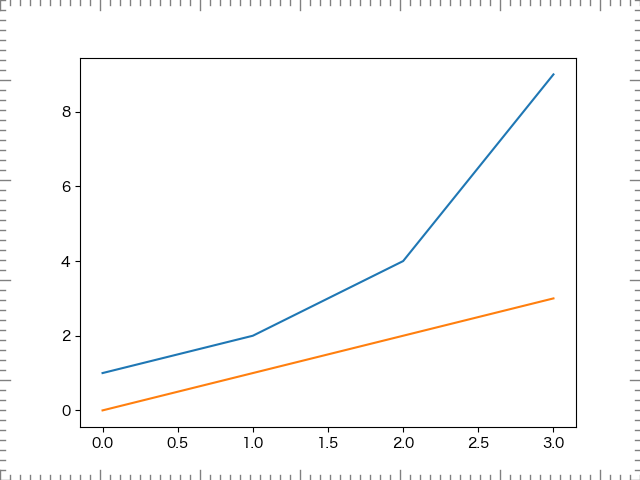
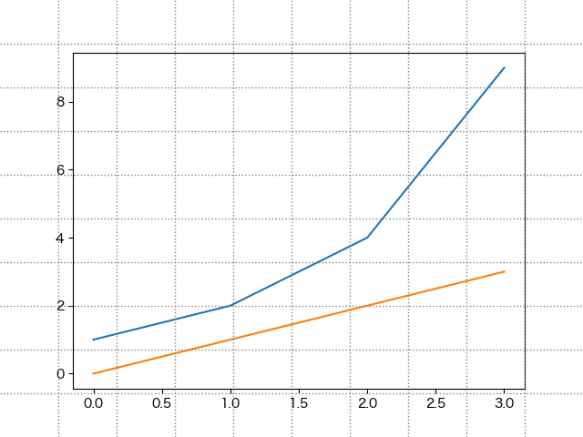
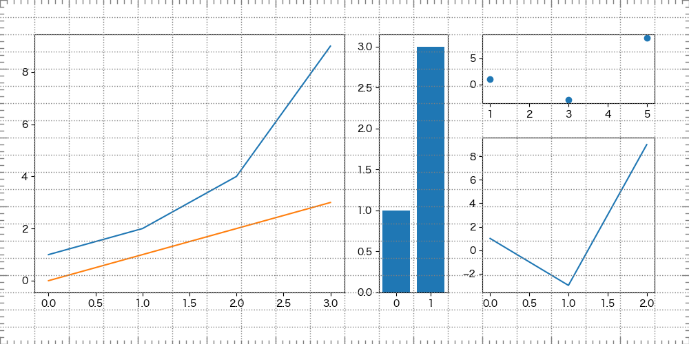

# mplruler

add Ruler on matplotlib figure

This is an auxiliary library for displaying rulers and grids in matplotlib's Figure.

Although they do not remain on the final figure, auxiliary lines and scales make it easy to grasp the position and size of the figure and make adjustments smoothly.

mlpruler has two functions.

* ruler
  * Display ruler in inches

* grid
  * Displays grid lines in fraction

## Example

With grid lines, it is easy to keep track of the width and position of the axes.

